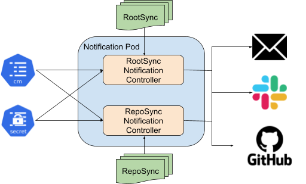
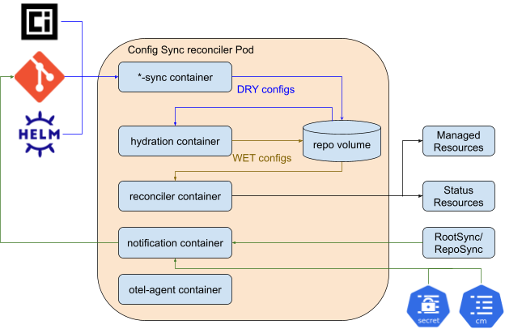

# Notifications in Config Sync

## Background

Config Sync surfaces the sync status via the status field in the RSync APIs. It
also provides the nomos CLI to report the status on all enrolled clusters.
However, customers have to manually run the nomos status command or check the
RSync object from time to time. They would like to have a timely notice for a
better user experience. To complete the user story, Config Sync needs to have a
controller monitoring the sync status and send alerts or notifications to the
user-provided platforms, such as GitHub, email, slack, etc.

## Requirements

- Support enabling and disabling the notification feature.
- Allow users to subscribe to the notification event per RSync basis.
- Support sending notifications for the sync status update (success or failure) caused by the change of the source configs, including changes from RSync spec, a new commit SHA, a new OCI image tag, or a new Helm chart release.
- Support sending notifications for each sync failure.
- Support subscribing to multiple notification events and services.
- Deduplicate repeated notification events.
- It only supports multi-repo mode.


## Design

This design leverages the notifications engine from the Argo project as a
subcomponent to deliver notifications. It requires building a notification
controller to monitor custom resources and deliver notifications. The machinery
required to build the controller is provided by pkg/controller and pkg/api
packages. The controller is an in-cluster component installed with Config Sync,
which talks to the Kubernetes cluster and is configured using a Kubernetes
ConfigMap and Secret with notification triggers and templates.

### Integrating argo-notifications in Config Sync

To integrate the Argo notifications engine with Config Sync, we will need to implement
a notification controller for monitoring `RepoSync` and `RootSync` objects. Argo
notifications-engine requires a controller to have a `NamespaceableResourceInterface`
with GVR information, an informer, and a notification API factory that handles
notifications processing.

The following sections cover some alternatives considered followed by the
proposed solution for integration.

#### ❌ Singleton controller (alternative considered)

As each controller watches for a particular GVR, one option is to have two singleton
controllers, one controller shared across all `RootSync` objects and the other one
for all `RepoSync` objects. The two controllers can live in two different containers,
but in the same Pod.



##### Issues

The singleton controller would live in the `config-management-system` namespace and
watch the `ConfigMap` and `Secret` in the same namespace. Both the controller and
`ConfigMap`/`Secret` would be shared by all RSync objects. It may not be an issue for
RootSyncs because they reside in the same namespace and the platform admins should
manage the credentials for the entire organization.

However, `RepoSync` objects live in different namespaces, and it should be the app
owner’s responsibility to manage the credentials for notifications. Below lists
the gaps using a singleton controller:
1) `RepoSync` owners may not have permission to update the Secret in the
`config-management-system` namespace. To make the single controller work for all
RepoSync objects, the `RepoSync` owners must define the Secret object in their
namespace and Config Sync must upsert it to the `config-management-system` namespace
(similar to the `git-creds` `Secret`).
2) The notification controller only supports specifying a single `Secret`, so we
would need to merge `Secrets` from multiple namespaces into a single `Secret` for the
notification controller to watch. This design would be both insecure and error-prone.
Secrets from multiple tenants/namespaces should not be shared in a single Secret,
and ideally also not shared in a single `Pod`/`Deployment`.
3) Therefore, the notification controller should conditionally use different
configs for different RepoSyncs. This is not directly supported by the notification
controller. We propose building a layer of abstraction on top of the notification
controller, One controller per RSync.

#### ❌ One controller per namespace (alternative considered)

To address the RBAC permission issue across namespaces, an alternative is to have
one `RootSync` notification controller and one `RepoSync` notification controller per
namespace. It is easy to configure a `RoleBinding` for the controllers to read the
`ConfigMap` and `Secret` in the same namespace. However, one notification controller
only watches a single `Secret`, while multiple `RepoSync` objects in the namespace
may use different Secrets to store the service credentials. That requires the
`reconciler-manager` to consolidate all Secrets into a single Secret per namespace,
which requires both read and write permissions to the `Secret`, which has security
concerns.

#### ❌ Embedded controller inside the reconciler container (alternative considered)

To keep the service credentials separate, the solution is to make the notification
controller per RSync basis. For the sake of minimal resource footprint, it would
be nice to embed the notification controller inside the reconciler container.
Basically, the container can run multiple controllers, including the reconciler,
remediator, finalizer controller, as well as the notification controller.

The Argo notifications engine uses the pure client-go library to implement the
controller logic, while the reconciler leverages the controller-runtime to manage
the controllers. If the reconciler’s entrypoint initiates the notification controller,
it has to start a new goroutine, build the informers, clientset, and the controller,
and then run the controller in the goroutine.

##### Pros
- Per-RSync granularity control on the notification configs.
  - Each RSync can configure the service credentials separately.
  - RSync owners can configure custom configurations (triggers, templates and services) individually.
- Restricted RBAC control over the notification configs.
  - RSync owners only manage their own configs. No cross-RSync configurations.
- Limited access to the service credentials.
- Minimal increase of resource footprint.

##### Cons
- Interleaving logs between the reconcile logic and notification logic.
- The reconciler container doesn’t watch the RSync object or ConfigMap/Secret,
so the watchers can’t be reused between the reconciler controller and the notification controller.
- The failure of the notification controller may take down the entire reconciler container.

#### ✅ One controller per RSync (proposed design)

To overcome the above issues a better fit is to have a separate container for
the notification controller for each RSync object, which loads the `ConfigMap` and
`Secret` on a per RSync basis. This also helps to deal with RSync
objects of various source types (git, oci, and helm), as they use different API
fields to configure similar functionality.



With this approach the `reconciler-manager` will create the `notification`
container as part of a `reconciler` deployment. Each R*Sync object will have an API
field which enables the notification controller. If this field is set, the
`reconciler-manager` will include the notification controller as part of the `Deployment`
of the `reconciler` associated with the R*Sync. For `RepoSync` objects, the
`reconciler-manager` will also upsert the `ConfigMap` and `Secret` from the `RepoSync`
namespace to the `config-management-system` namespace for use by the ns-reconciler.

##### Pros
- Per-RSync granularity control on the notification configs.
  - Each RSync can configure the service credentials separately.
  - RSync owners can configure custom configurations (triggers, templates and services) individually.
- Restricted RBAC control over the notification configs.
  - RSync owners only manage their own configs. No cross-RSync configurations.
- Limited access to the service credentials.

##### Cons
- More resource footprint as each RSync will have its own notification controller.

### API Changes

#### Configuring notifications

A new `NotificationConfig` type will be added:

```golang
// NotificationConfig defines the configurations for notifications.
type NotificationConfig struct {
        ConfigMapRef *ConfigMapReference `json:"configMapRef,omitempty"`
        SecretRef    *SecretReference    `json:"secretRef,omitempty"`
}

// ConfigMapReference contains the reference to the ConfigMap. The namespace is
// assumed to be the same as the RootSync/RepoSync.
type ConfigMapReference struct {
        // name represents the ConfigMap name.
        // +optional
        Name string `json:"name,omitempty"`
}
```

The `NotificationConfig` type will be used in both `RootSync.spec` and `RepoSync.spec`:

```golang
// RootSyncSpec defines the desired state of RootSync
type RootSyncSpec struct {
        // notificationConfig specifies references to the notification configs.
        // +nullable
        // +optional
        NotificationConfig *NotificationConfig `json:"notificationConfig,omitempty"`
}

// RepoSyncSpec defines the desired state of a RepoSync.
type RepoSyncSpec struct {
        // notificationConfig specifies references to the notification configs.
        // +nullable
        // +optional
        NotificationConfig *NotificationConfig `json:"notificationConfig,omitempty"`
}
```

If the value of `.spec.notificationConfig` is not nil, then the `reconciler-manager`
will consider the notification feature enabled and will create the
`notification` container as part of the `reconciler` `Deployment`. The `notification`
container will be configured to ingest the contents of the `ConfigMap` and `Secret`
referenced in the `NotificationConfig`.

Configuring the contents of the `ConfigMap` and `Secret` are considered out of
scope of this design doc, as this API interfaces directly with the Argo
notifications-engine. We will provide a catalog of recommended triggers/templates
to help users get started.

#### Surfacing notification status

The status of notifications will be surfaced in a new `Notification` CRD. The
`reconciler-manager` will handle the lifecycle of the object, and the
status will be updated by the `notification` container in the `reconciler` pod.
This introduces an interface for monitoring notification status while maintaining
separation of concerns between the notification and reconciler controller.

```golang
// Notification is the Schema for the `RepoSync` notification API
type Notification struct {
        metav1.TypeMeta `json:",inline"`
        // +optional
        metav1.ObjectMeta `json:"metadata,omitempty"`
        // +optional
        Status NotificationStatus `json:"status,omitempty"`
}

type NotificationStatus struct {
        // hash of the source of truth that is rendered.
        // It can be a git commit hash, or an OCI image digest.
        // +optional
        Commit string `json:"commit,omitempty"`
        // lastUpdate is the timestamp of when this status was last updated by a
        // reconciler.
        // +nullable
        // +optional
        LastUpdate metav1.Time `json:"lastUpdate,omitempty"`
        // errors is a list of any errors that occurred while sending notifications
        // from the change indicated by Commit.
        // +optional
        Errors []NotificationError `json:"notificationError,omitempty"`
}

type NotificationError struct {
        // trigger is the name of the trigger
        // +optional
        Trigger string `json:"trigger"`
        // service is the name of the destination service
        // +optional
        Service string `json:"service"`
        // message is the contents of the notification message
        // +optional
        Message string `json:"message"`
        // errorMessage describes the error that occurred.
        // +optional
        ErrorMessage string `json:"errorMessage"`
}
```

