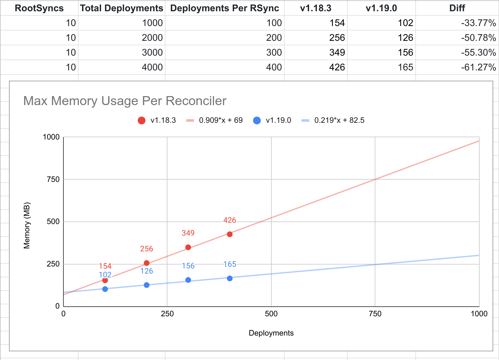
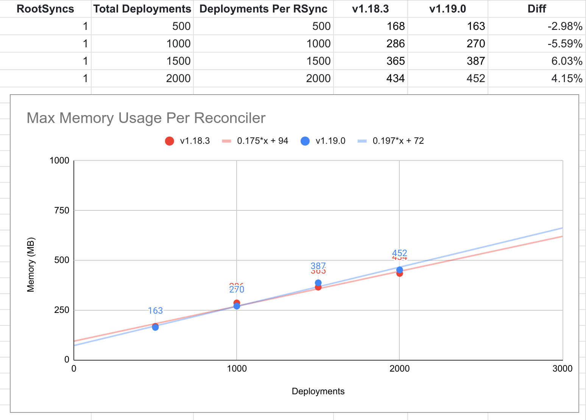
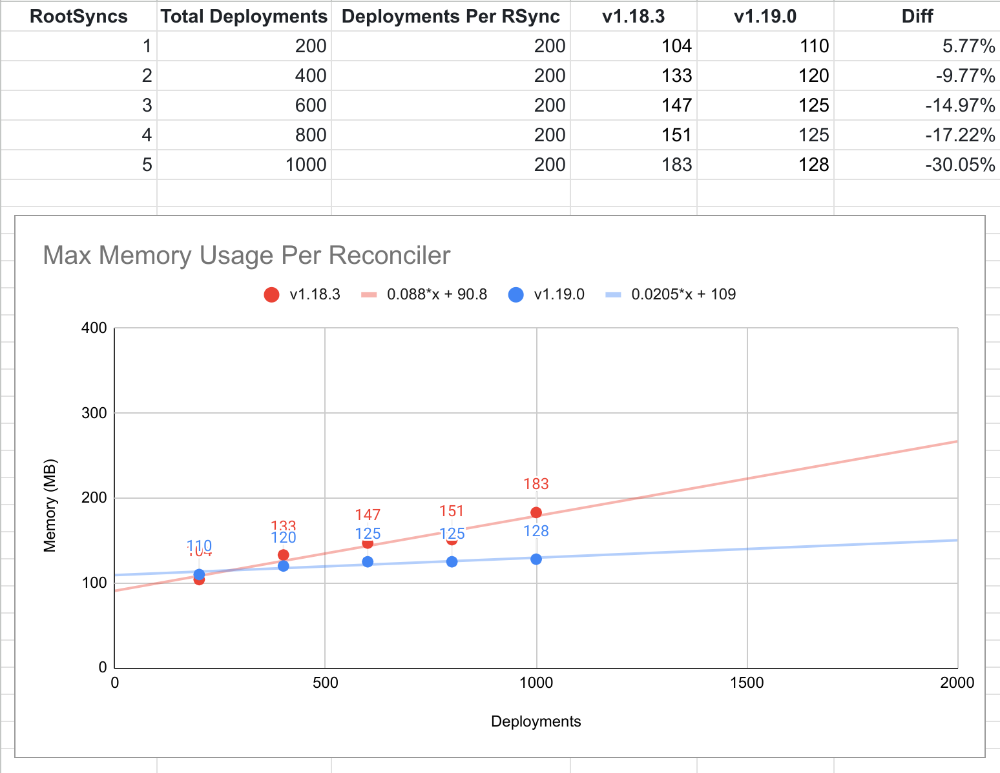
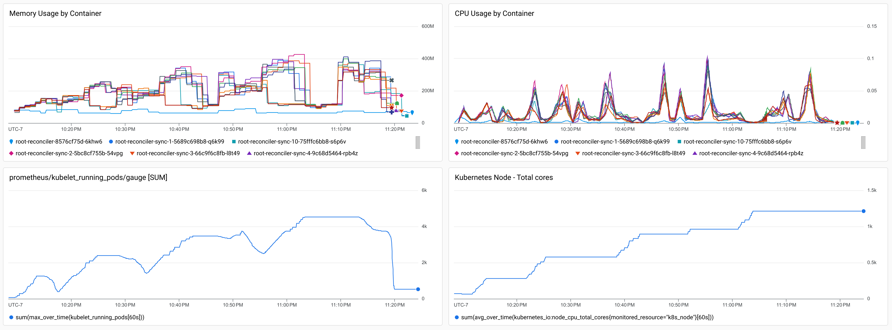
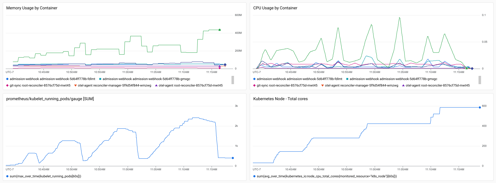
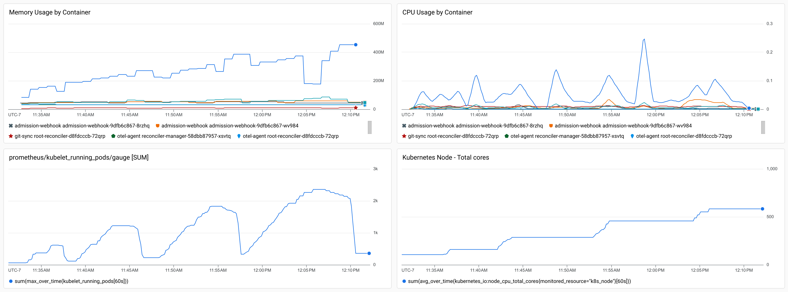
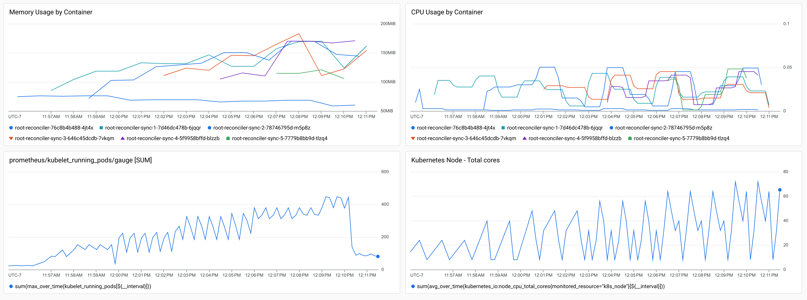
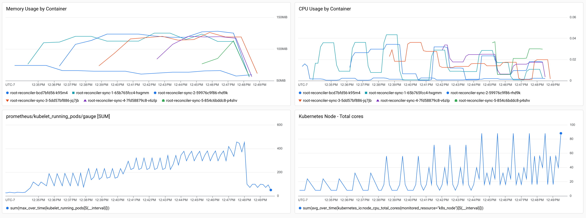

# Config Sync Watch Filtering v1.18 vs v1.19

Config Sync v1.19 includes a significant new optimization:
[watch filtering](https://github.com/GoogleContainerTools/kpt-config-sync/pull/1301).

Watch calls to the Kubernetes API now include a
[label selector](https://kubernetes.io/docs/concepts/overview/working-with-objects/labels/),
which can significantly reduce the number of objects sent from the server to the
client, and thus significantly reduce the compute resources used to parse,
process, and cache objects in the client.

### Design

When using Config Sync, RootSyncs and RepoSyncs each get their own reconciler
Deployment, a single Pod with multiple containers. The most significant of those
containers is the reconciler, which handles syncing objects to the cluster.

To do so, the reconciler performs many list requests and sustains many watch
streams, to receive continuous updates from the server about resources it
manages. These list and watch requests are generally already more efficient than
making many get requests for every individual object, but they trade higher
memory use for fewer API calls and lower latency. In addition to the CPU and
memory used to process these API calls, caching is used to detect drift,
tolerate missed events, and reduce the need to make asynchronous get calls.

Historically, Config Sync has used namespace filtering to reduce the scope of
list and watch calls, reducing the compute needed to process and cache the
results. However, in version 1.19.0, we also added label filtering, which
further reduces the number of objects processed by Config Sync, down to just the
ones that have the labels used by that specific reconciler.

With this change, reconcilers will no longer receive list entries or watch
events for objects they don't manage, and those objects will not be cached in
the reconciler's memory. This reduces the memory used by reconcilers that have
overlapping resource types and objects in the same namespaces.

### Affected Use Cases

-  RootSyncs that manage objects with the same resource type.
-  RepoSync that manage objects with the same resource type in the same namespace.
-  RootSyncs and RepoSync that manage objects with the same resource type in the
   same namespace.

Exception: RootSync reconcilers have an additional optimization which reduces
the scope of watches when all managed objects are in the same namespace. This
makes them perform more like a RepoSync reconciler is this particular scenario,
which reduces the effectiveness of label filtering relative to other RootSync
reconcilers, which watch resources in all namespaces.

### Scenario A: 10 RootSyncs with 400 Deployments Each

In this scenario, 10 RootSyncs are created, each pointing to a different
directory in the same Git repository. Each directory contains a number of
uniquely named Deployment manifests, all in the same namespace.

This demonstrates a best-case scenario for watch filtering where all the managed
objects are large, the same resource type, and in the same namespace.

These results show a linear increase in memory reduction, as the number of
overlapping resources increase.

### Scenario B: 1 RootSync with 2000 Deployments Each

In this scenario, 1 RootSync is created, pointing to a Git repository containing
a number of uniquely named Deployment manifests, all in the same namespace.

This demonstrates a worst-case scenario for watch filtering where none of the
resources being watched overlap with any other objects on the cluster.

These results show no statistically relevant change in memory use between
Config Sync versions 1.18 and 1.19.

So if you only ever use one RootSync, you're unlikely to see much reduction in
memory use or cost, unless there are lots of similar resources managed by
other clients.

### Scenario C: 1-5 RootSync with 200 Deployments Each

In this scenario, 5 RootSyncs are created, one at a time, pointing to a Git
repository containing 200 uniquely named Deployment manifests, all in the same
namespace.

This demonstrates that memory usage in Config Sync v1.18 increased with number
of watched resources, even when the objects being managed by any individual
RootSync did not change. However, in Config Sync v1.19, the memory usage remains
relatively consistent as new RootSyncs are added, even when the resource types
and namespaces overlap.

This shows that Config Sync v1.19 scales significantly better than v1.18, when
syncing many large objects with overlapping resources and namespaces. However,
it also shows that for smaller packages, the minimum memory use is around 100MiB
per reconciler container.

### Summary

With these results, we can determine that the memory reduction from watch
filtering increases linearly with the number of overlapping objects of the same
resource type in watched namespaces and linearly with the number of
reconcilers syncing those objects.

Together, they represent the potential for exponential reduction in memory use,
given the right circumstances. However, individual results may vary, and not all
use cases will see the same reduction in compute resource consumption.

In general, the more RootSyncs and RepoSync you use with overlapping resources
and namespaces, the greater the memory reduction will be, and the cheaper it
will cost to operate Config Sync.

### Appendix: Metadata

Config Sync v1.19.0 adds the following metadata.

Labels:

-   `applyset.kubernetes.io/id: <APPLYSET_ID>` -
    Indicates that the RootSync or RepoSync object is the parent of the
    specified ApplySet.
-   `applyset.kubernetes.io/part-of: <APPLYSET_ID>` -
    Indicates that the resource object is a member of the specified ApplySet.

Annotations:

-   `applyset.kubernetes.io/tooling: configsync.gke.io/v1` -
    Indicates that the ApplySet specified by the `applyset.kubernetes.io/id`
    label is managed by Config Sync. Only set on ApplySet parents, not members.

This metadata is specified by the
[ApplySet KEP](https://github.com/kubernetes/enhancements/blob/master/keps/sig-cli/3659-kubectl-apply-prune/README.md).

While this metadata can also be set by `kubectl` when you apply with the
`--applyset` option, Config Sync and kubectl cannot be used to manage the same
ApplySets.

### Appendix: Scenario A

The following graphs show metrics taken while executing the test
`TestProfilingResourcesByObjectCountWithMultiSync` with 4 steps, 1,000
Deployments per step, and 10 RootSyncs.

**Config Sync v1.18.3**

**Config Sync v1.19.0**

### Appendix: Scenario B

The following graphs show metrics taken while executing the test
`TestProfilingResourcesByObjectCount` with 4 steps, 500 Deployments per step,
and 1 RootSync.

**Config Sync v1.18.3**

**Config Sync v1.19.0**

### Appendix: Scenario C

The following graphs show metrics taken while executing the test
`TestProfilingByObjectCountAndSyncCount` with 5 steps, 200 Deployments per sync,
and 1 RootSync added at each step.

**Config Sync v1.18.3**

**Config Sync v1.19.0**

