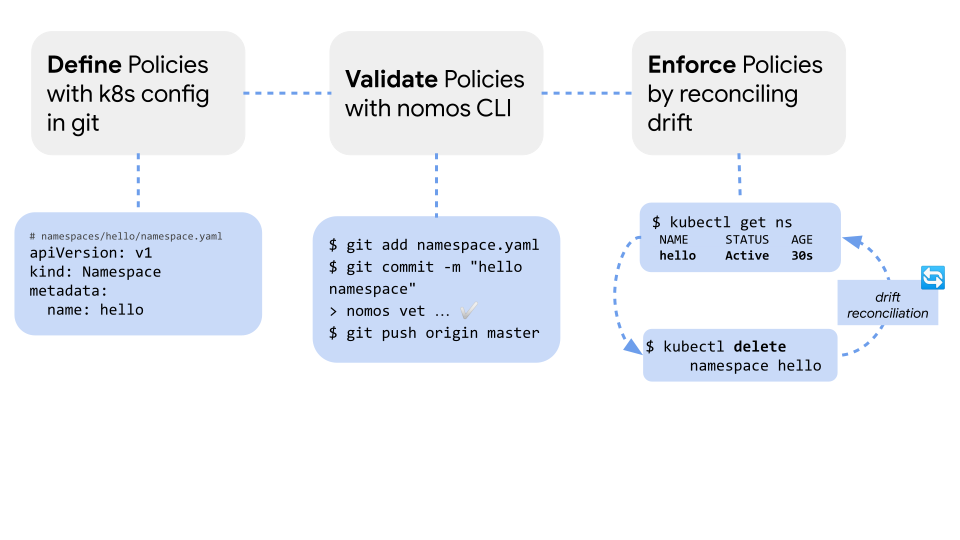

# Hello, Namespace!

This is a simple example for generalizing how to define and
enforce configuration.



## Contents

* [Prerequisites](#prerequisites)
* [Setup](#setup)
  * [Fork and Clone this Repo](#fork-and-clone-this-repo)
  * [Sync ACM Operator](#sync-acm-operator)
* [Config Overview](#config-overview)
* [Define a Namespace as Config](#define-a-namespace-as-config)
* [Validating Changes](#validating-changes)
* [Rollback Changes](#rollback-changes)
* [Drift Reconciliation](#drift-reconciliation)

### Prerequisites

* Install the [Cloud SDK (gcloud CLI)](https://cloud.google.com/sdk/docs/quickstarts)
* Install [kubectl](https://kubernetes.io/docs/tasks/tools/install-kubectl/#download-as-part-of-the-google-cloud-sdk)
* Install the [nomos CLI](https://cloud.google.com/anthos-config-management/downloads) for managing ACM across clusters
* Create or select a [GKE Cluster](https://cloud.google.com/kubernetes-engine/docs/how-to/creating-a-cluster) with the [ACM Operator installed](https://cloud.google.com/anthos-config-management/docs/how-to/installing)

## Setup

This example assumes you have a GKE cluster with ACM installed and with [read access](https://cloud.google.com/anthos-config-management/docs/how-to/installing#git-creds-secret) to a fork of this repo.  

To setup the clusters for this example you will need to:

* [Fork and clone this repo](#fork-and-clone-this-repo)
* [Sync cluster's ACM operator with this directory](#sync-acm-operator).

### Fork and clone this repo

1. Fork this repo to your account

1. In your terminal, clone this repo locally. 

      ```console
      $ git clone https://github.com/<GITHUB_USERNAME>/csp-config-management.git
      $ cd csp-config-management/hello-namespace/
      ```

### Sync ACM Operator

The cluster's ACM Operator must be configured to point to this directory.

1. Update [setup/hello-namespace/config-management.yaml](setup/hello-namespace/config-management.yaml) to include your cluster name and git username.

1. Apply the sync config to your cluster

    ```console
    $ kubectl apply -f setup/hello-namespace/config-management.yaml
    ```

1. Confirm the sync was successful with `nomos status`

    ```console
    $ nomos status
    Connecting to clusters...
    Context                                 Status           Last Synced Token
    -------                                 ------           -----------------
    my-acm-cluster-context                  SYNCED           <some commit hash>
    ```

## Config Overview

```console
config-root/
├── README.md
├── system/
├── clusterregistry/
├── cluster/
└── namespaces/ # configs that are scoped to namespaces
    └── hello
        └── namespace.yaml # defines a namespace named "hello-namespace"
```

## Define a Namespace as Config

In this directory, we have a namespace defined in [config-root/namespaces/hello](config-root/namespaces/hello/)

```yaml
# namespaces/hello/namespace.yaml
apiVersion: v1
kind: Namespace
metadata:
  name: hello
```

```console
$ kubectl get namespaces
NAME                       STATUS   AGE
hello                      Active   30s ## created by ACM
config-management-system   Active   5m  ## ACM Operator system
default                    Active   22m
kube-public                Active   22m
kube-system                Active   22m
```

## Validating Changes

To edit objects managed by Anthos Config Management, their definitions should be updated in git.

1. Change to [hello-namespace](.) directory

    ```console
    $ cd docs/hello-namespace/
    ```

1. Edit [config-root/namespaces/hello/namespace.yaml](config-root/namespaces/hello/namespace.yaml)

    ```yaml
    apiVersion: v1
    kind: Namespace
    metadata:
      name: goodbye
    ```

1. Validate the changes with the `nomos` CLI
  From the [hello-namespace/](.) directory run:

    ```console
    $ nomos vet --path=config-root
    Found issues: 1 error(s)

    [1] KNV1020: A Namespace MUST declare `metadata.name` that matches the name of its directory.

    expected metadata.name: hello
    ```

    The `nomos vet` command allows us to check for errors before pushing bad config to our cluster.  It is strongly advised that `nomos vet` is ran as a pre-commit hook.

  According to this error, the directory name must match the name present in the config.

1. Rename the directory and validate the change again

    ```console
    $ cd config-root
    $ mv namespaces/hello namespaces/goodbye
    $ nomos vet --path=.
    <no output, no errors found>
    ```

    Great! Now we can push to git

1. Push updated namespace to remote repo

    ```console
    $ git add namespaces/
    $ git commit -m "renamed namespace to goodbye"
    $ git push origin master
    ```

1. Observe change in cluster with `kubectl`

    ```console
    $ kubectl get namespace hello
      NAME              STATUS       AGE
      hello             Terminating   5m
    $ kubectll get namespace goodbye
      NAME               STATUS   AGE
      goodbye            Active   30s
    ```

## Rollback Changes

Now that we have successfully updated our config, let's try rolling it back.

1. Revert last commit and push to remote

    ```console
    $ git revert HEAD
    $ git push origin master
    ```

1. Confirm namespace name was reverted with `kubectl`

    ```console
    $ kubectl get namespace goodbye
      NAME               STATUS       AGE
      goodbye            Terminating   5m
    $ kubectll get namespace hello
      NAME               STATUS   AGE
      hello              Active   30s
    ```

## Drift Reconciliation

The ACM operator checks for drift between cluster state and what is defined in git.  If resources are manually deleted, the ACM operator will perform reconciliation to ensure cluster state matches your repo.

Let's try to manually remove the `hello` namespace.

1. Delete the namespace with `kubectl`

   ```console
   $ kubectl delete namespace hello
   namespace "hello" deleted
   ```

1. Check to see if namespace exists in the cluster

    ```console
    $ kubectl get namespace hello
      NAME              STATUS   AGE
      hello             Active   30s
    ```

    The drift was observed and successfully reconciled by ACM.
